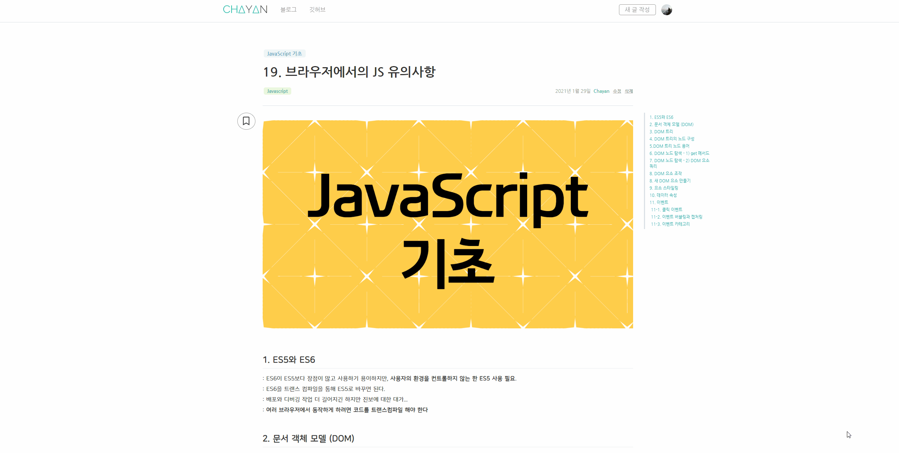
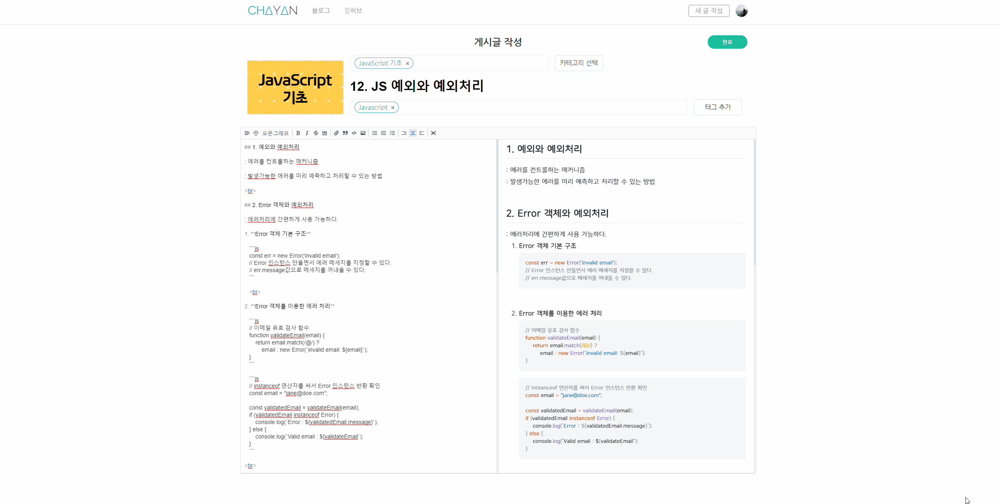

<h1 align='middle'>💻 Chayan's Dev Blog</h1>

<h3 align='middle'><a target="_blank" href="https://dev.chayan.io">dev.chayan.io</a></h3>

<h3 align='middle'> 개인 정리용 블로그 웹 프로젝트</h3>

📝 <strong>개인 정리 노트</strong> 및 <strong>포스트 정리</strong>를 위한 블로그 구축 프로젝트입니다 
    
    <svg xmlns="http://www.w3.org/2000/svg" xmlns:xlink="http://www.w3.org/1999/xlink" width="65" height="20" role="img" aria-label="Javascript"><title>Javascript</title><linearGradient id="s" x2="0" y2="100%"><stop offset="0" stop-color="#bbb" stop-opacity=".1"/><stop offset="1" stop-opacity=".1"/></linearGradient><clipPath id="r"><rect width="65" height="20" rx="3" fill="#fff"/></clipPath><g clip-path="url(#r)"><rect width="0" height="20" fill="#dfb317"/><rect x="0" width="65" height="20" fill="#dfb317"/><rect width="65" height="20" fill="url(#s)"/></g><g fill="#fff" text-anchor="middle" font-family="Verdana,Geneva,DejaVu Sans,sans-serif" text-rendering="geometricPrecision" font-size="110"><text aria-hidden="true" x="325" y="150" fill="#010101" fill-opacity=".3" transform="scale(.1)" textLength="550">Javascript</text><text x="325" y="140" transform="scale(.1)" fill="#fff" textLength="550">Javascript</text></g></svg>
    
    <svg xmlns="http://www.w3.org/2000/svg" xmlns:xlink="http://www.w3.org/1999/xlink" width="73" height="20" role="img" aria-label="React(CRA)"><title>React(CRA)</title><linearGradient id="s" x2="0" y2="100%"><stop offset="0" stop-color="#bbb" stop-opacity=".1"/><stop offset="1" stop-opacity=".1"/></linearGradient><clipPath id="r"><rect width="73" height="20" rx="3" fill="#fff"/></clipPath><g clip-path="url(#r)"><rect width="0" height="20" fill="#007ec6"/><rect x="0" width="73" height="20" fill="#007ec6"/><rect width="73" height="20" fill="url(#s)"/></g><g fill="#fff" text-anchor="middle" font-family="Verdana,Geneva,DejaVu Sans,sans-serif" text-rendering="geometricPrecision" font-size="110"><text aria-hidden="true" x="365" y="150" fill="#010101" fill-opacity=".3" transform="scale(.1)" textLength="630">React(CRA)</text><text x="365" y="140" transform="scale(.1)" fill="#fff" textLength="630">React(CRA)</text></g></svg>
    
    <svg xmlns="http://www.w3.org/2000/svg" xmlns:xlink="http://www.w3.org/1999/xlink" width="53" height="20" role="img" aria-label="firebase"><title>firebase</title><linearGradient id="s" x2="0" y2="100%"><stop offset="0" stop-color="#bbb" stop-opacity=".1"/><stop offset="1" stop-opacity=".1"/></linearGradient><clipPath id="r"><rect width="53" height="20" rx="3" fill="#fff"/></clipPath><g clip-path="url(#r)"><rect width="0" height="20" fill="#e05d44"/><rect x="0" width="53" height="20" fill="#e05d44"/><rect width="53" height="20" fill="url(#s)"/></g><g fill="#fff" text-anchor="middle" font-family="Verdana,Geneva,DejaVu Sans,sans-serif" text-rendering="geometricPrecision" font-size="110"><text aria-hidden="true" x="265" y="150" fill="#010101" fill-opacity=".3" transform="scale(.1)" textLength="430">firebase</text><text x="265" y="140" transform="scale(.1)" fill="#fff" textLength="430">firebase</text></g></svg>
    
      
   <strong>현재 진행도 👨‍💻</strong> 
    <progress value="80" max="100"></progress>&nbsp;80%

## 👨‍💻 관련 포스트
**[블로그 프로젝트 1차 회고](https://dev.chayan.io/post/블로그 프로젝트 1차 회고)**

**[블로그 프로젝트 2차 회고](https://dev.chayan.io/post/블로그 프로젝트 2차 회고)**

 

## 💻 화면 구성 UI

|          메인 페이지           |
| :----------------------------------: |
|    |
|   **포스트 페이지**   |
|  |
|     **게시글 작성 및 수정 페이지**     |
|    |
|        **인증(로그인, 회원가입) 페이지**        |
|  |
| **카테고리, 태그 관리 페이지** |
|  |

