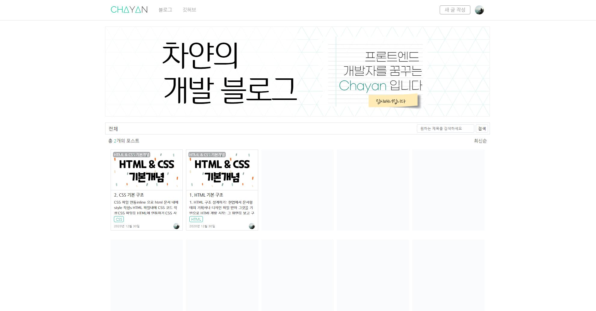
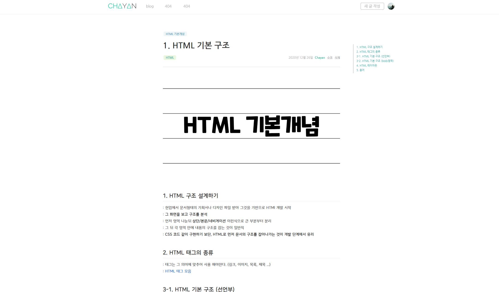
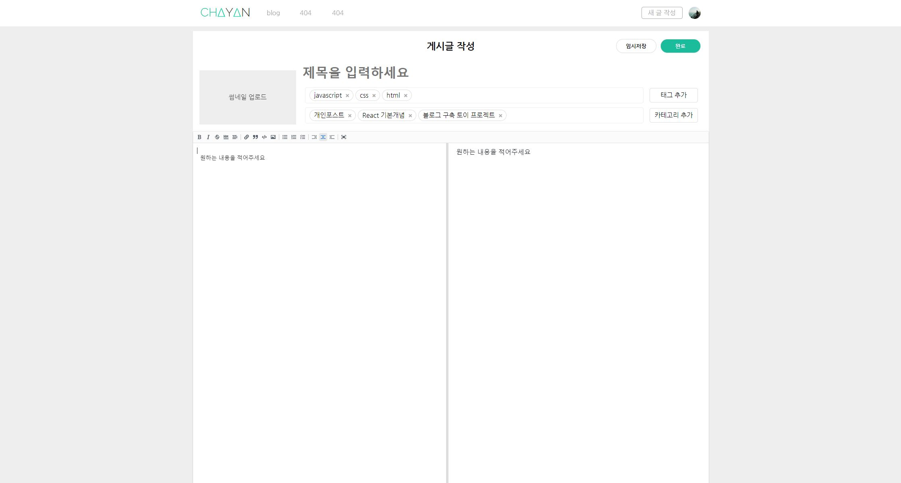

<h1 align='middle'>💻 Chayan's Blog</h1>

   
   
   

   
          
<h3 align='middle'> 개인 정리용 블로그 웹 프로젝트</h3>

📝 <strong>개인 정리 노트</strong> 및 <strong>포스트 정리</strong>를 위한 블로그 구축 프로젝트입니다  
   <strong>현재 진행도 👨‍💻</strong> 
    <progress value="5" max="100"></progress>&nbsp;5%

### 서론
-----

✍️✍️✍️ 작성중입니다

 

### 화면 구성 UI
------

최종적으론 구성 UI로 업데이트 예정

**현재는 프로토타이핑 용 이미지로 대체**

|          메인 페이지 [ / ]           |
| :----------------------------------: |
|     |
| **포스트 목록 페이지 [ /articles ]** |
|     |
|   **게시글 페이지 [ /id=312343 ]**   |
|     |
|     **게시글 페이지 [ /write ]**     |
|    |
|        **🔨 추후 업데이트 🔨**         |

