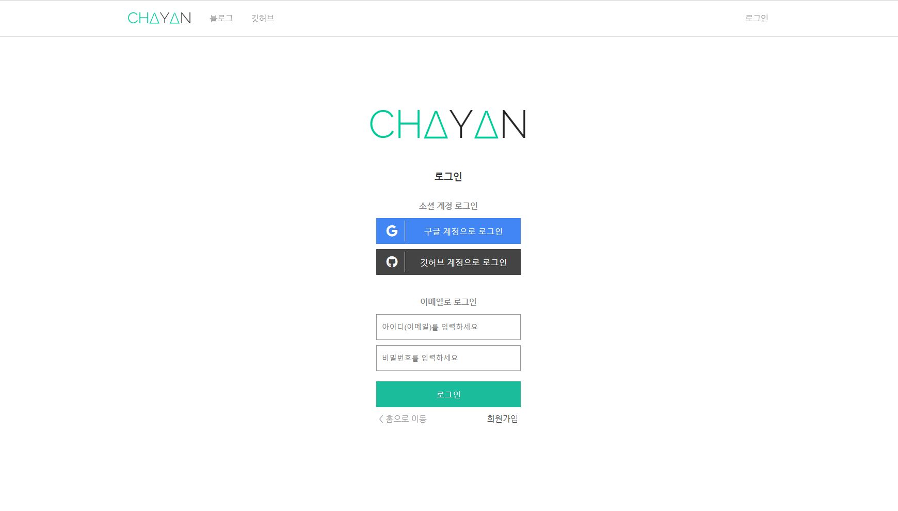

<h1 align='middle'>💻 Chayan's Blog</h1>

<a target="_blank" href="https://dev.chayan.io">dev.chayan.io</a>

<h3 align='middle'> 개인 정리용 블로그 웹 프로젝트</h3>

📝 <strong>개인 정리 노트</strong> 및 <strong>포스트 정리</strong>를 위한 블로그 구축 프로젝트입니다  
   <strong>현재 진행도 👨‍💻</strong> 
    <progress value="50" max="100"></progress>&nbsp;50%

### 👨‍💻 서론
-----
[블로그 프로젝트 구현하기](https://dev.chayan.io/post/%EB%B8%94%EB%A1%9C%EA%B7%B8%20%EA%B5%AC%ED%98%84%20%ED%94%84%EB%A1%9C%EC%A0%9D%ED%8A%B8%20%ED%9A%8C%EA%B3%A0)

 

### 💻 화면 구성 UI
------

|          메인 페이지 [ / ]           |
| :----------------------------------: |
|     |
|   **post 페이지**   |
|     |
|     **게시글 작성 및 수정 페이지**     |
|    |
|        **인증(로그인, 회원가입)**        |
|  |
| **🔨 추후 업데이트 🔨** |
| 유저 글 목록, 유저 기본 정보 등 |

